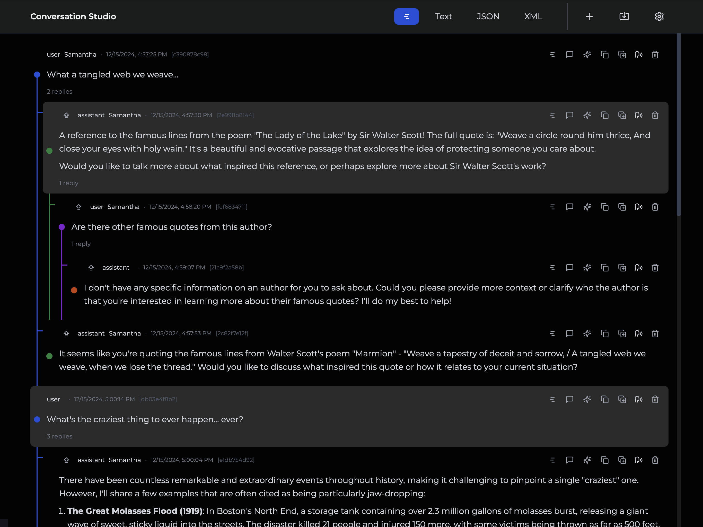

# Conversation Studio: Your Tool for Dynamic Conversation Remixing and Analysis

[Web](https://conversation-studio.succinct.link)

Most AI Chat applications are structured like
[instant messaging applications](https://en.wikipedia.org/wiki/Instant_messaging) where a *user* has a linear conversation with a single *assistant*.

Conversation Studio allows you to step back and manage multiple conversations at once. It's structured like a [forum](https://en.wikipedia.org/wiki/Internet_forum) with multiple threads and nested replies.

Use Conversation Studio to rearrange, remix, and edit your conversations to elicit different insights and responses from your models.

## Key Features

- **Dynamic Thread Rearrangement:**  
  Drag and drop entire conversation threads or individual messages to form new narratives. Group related content together to create a more meaningful flow.

- **Color-Coded Nesting:**  
  Each level of the conversation hierarchy is visually distinguished by a unique color. For example, top-level threads might appear in **blue**, direct replies in **green**, and deeper nested responses in **yellow**. This visual cue makes it easy to navigate even the most complex discussions at a glance.

- **Import & Export:**  
  Bring in your conversation data from multiple formats (text, JSON, XML) and export your refined sets when you're done. Perfect for sharing with colleagues, backing up progress, or preparing input for language models.

- **Local Storage:**  
  Your data stays accessible, even offline. **Conversation Studio** stores your edited conversations locally, ensuring quick access without the need for constant server calls.

- **Connect to AI:**  
  Feed conversations directly into AI models, either through an OpenAI-compatible API, or through the Chrome's built-in experimental window.ai API.

- **Speech Synthesis:**  
  Listen to conversations read aloud in multiple voices.

## Usage: Web

Visit https://conversation-studio.succinct.link

If you plan to use ollama, but sure to set the `OLLAMA_ORIGINS` environment variable to `https://conversation-studio.succinct.link` before starting ollama (see below).

## Usage: Local

1. **Clone this Repository**  
  git clone github.com/johnhenry/conversation-studio.git
1. **Move into the Project Directory**  
  cd conversation-studio
1. **Install Dependencies**  
  npm install
1. **Start the App**  
  npm run dev
1. **Open the App in a Browser**  
  https://localhost:5173

If you plan to use ollama, but sure to set the `OLLAMA_ORIGINS` environment variable to `https://localhost:5173` before starting ollama (see below).

## Using AI

By default, AI features are disabled.
To enable AI Generation features,
open the settings panel and in the AI section
select your chosen AI Type.

### OpenAI

You can use any OpenAI-compatible API.
By default, we point to the local URL used by [ollama](https://ollama.com).

#### Ollama
If you plan to run this with ollama, you may have to set your `OLLAMA_ORIGINS` environment variable.

  - Hosted site - `setenv OLLAMA_ORIGINS "https://conversation-studio.succinct.link"` (MacOS)
  - Local - `setenv OLLAMA_ORIGINS "http://localhost:5173"` (MacOS)

### Windows.ai

The window.ai API is very much a work in progress. Use at your own risk.
It's tricky to install, and even if you get it installed, it's prone to breakage.

The developer of [page assist](https://github.com/n4ze3m/page-assist) posted [this video](https://www.youtube.com/watch?v=NxKXcMgiz5k&ab_channel=HappyComputingwithDennis), which should help you get it installed.

And while you can get this working in the standard release version of Chrome, I find it to be more stable in Canary (ironically).

## Keyboard Shortcuts

- New Message: n
- Reply to message: r
- Auto-Reply to message: shift + r
- Clone message: c
- Clone message w/ replies: shift + c
- Toggle forum/chat mode: m
- Speak selected conversation: s
- Edit message: e
- Cycle message type: t
- Navigate between threads: left/right arrow keys
- Navigate between replies: up/down arrow keys

## Known Issues

### Importing

- Importing JSON -- works once, but not subsequently until a page is reloaded.
- Importing XML -- does not work
- Importing Text -- does not work

### Mobile Support (local network hosting)

- Control is a bit clunky on mobile
- Cannot seem to get AI features to work on mobile via local OpenAI API

## Roadmap

### Importing

When it works, importing currently replaces existing data, we should have some sort of merging algorithm.

### Anti-Social Network Integrations

This was originally imagined as an interface for the [AntiSocial Network](https://github.com/johnhenry/antisocial-network) project. We will bring this full circle.

### Store as PGLite

### Connect to external services
 - Minio/AWS
 - Ipfs
 - Postgre SQL
 - MCP

### License

MIT